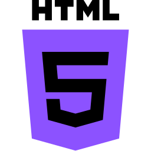
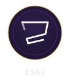
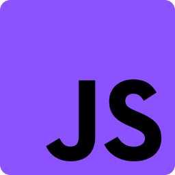
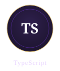
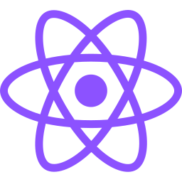
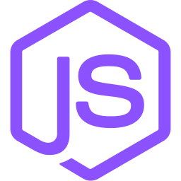
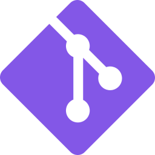
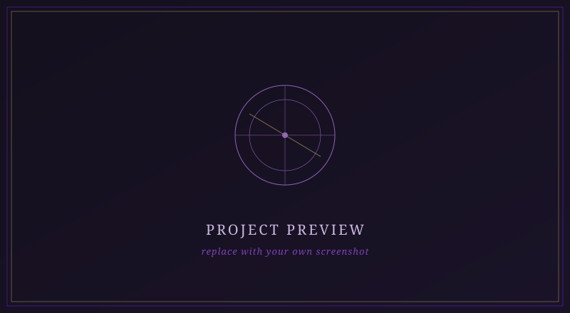
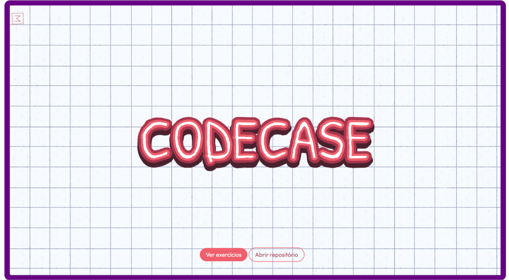
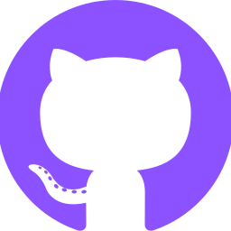

<div align="center">


<br/>

</div>


## 𝔄𝔟𝔬𝔲𝔱

<table>
<tr>
<td width="50%" valign="top">

**Português**

Meu nome é Kauã Mariano Santinho, tenho 17 anos e atualmente curso o Técnico em Desenvolvimento de Sistemas. Tenho grande interesse pelo desenvolvimento Front-End e estou aprofundando meus estudos em React, Node.js e TypeScript. Gosto de transformar ideias em interfaces bem estruturadas, buscando sempre aprender novas tecnologias e evoluir constantemente como desenvolvedor.

</td>
<td width="50%" valign="top">

**English**

My name is Kauã Mariano Santinho. I'm 17 years old and currently studying Systems Development at a technical school. I'm focused on Front-End Development and currently improving my skills in React, Node.js and TypeScript. I enjoy turning ideas into well-crafted interfaces and I'm always looking to learn new technologies and continuously grow as a developer.

</td>
</tr>
</table>


## 𝔗𝔢𝔠𝔥𝔫𝔬𝔩𝔬𝔤𝔦𝔢𝔰

<div align="center">

&nbsp;&nbsp;
&nbsp;&nbsp;
&nbsp;&nbsp;
&nbsp;&nbsp;
&nbsp;&nbsp;
&nbsp;&nbsp;


<br/><br/>

&nbsp;&nbsp;
&nbsp;&nbsp;
&nbsp;&nbsp;


</div>


## 𝔖𝔱𝔞𝔱𝔦𝔰𝔱𝔦𝔠𝔰

<div align="center">


<br/>


<br/>

<br/>


<br/><br/>

<br/><br/>

</div>


## 𝔉𝔢𝔞𝔱𝔲𝔯𝔢𝔡 𝔓𝔯𝔬𝔧𝔢𝔠𝔱𝔰

<table>
<tr>
<td width="50%">


**Guru's Learn**
Em desenvolvimento, 3/4.

<div align=center>

`React` `TypeScript` `Node.js` `SQL`

</div>


<div align=center>

<a href="https://github.com/dev-kauams"></a>
<a href="#"></a>

</div>

</td>
<td width="50%">


**CodeCase**
Base pública finalizada.

<div align=center>

`HTML5` `CSS3` `JavaScript` `Node.js` `SQL`
  
</div>


<div align=center>

<a href="https://github.com/dev-kauams/codecase"></a>
<a href="https://codecase-dev.vercel.app/"></a>

</div>

</td>
</tr>
</table>

<details>
<summary><strong>Caso tu queira usar meu template</strong></summary>

```md
<td width="50%">


**Project Name**
Short, objective description of what the project does and the problem it solves.

`Tech` `Tech` `Tech`

<a href="REPO_URL"></a>
<a href="DEMO_URL"></a>

</td>
```

Replace `./assets/project-placeholder.svg` with an actual screenshot, and `REPO_URL` / `DEMO_URL` with the real links.

</details>


## ℭ𝔬𝔫𝔱𝔞𝔠𝔱

<div align="center">

<a href="https://github.com/dev-kauams"></a>&nbsp;&nbsp;&nbsp;
<a href="https://linkedin.com/in/dev-kauams"></a>&nbsp;&nbsp;&nbsp;
<a href="https://youtube.com/@dev-kauams"></a>&nbsp;&nbsp;&nbsp;
<a href="mailto:kauams.profissional@gmail.com"></a>

</div>

<br/>

<div align="center">

</div>
