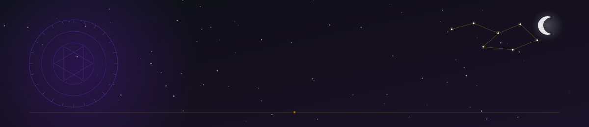

<div align="center">



<br />


</div>

<br />


<br /><br />

I'm a developer focused on building clean, reliable, and well-crafted software —
from interfaces to the systems behind them. I care about precision, readability,
and design that ages well.

Currently exploring modern front-end architecture, developer tooling, and the
quiet discipline of writing code that is easy to reason about.

<br />


<br /><br />

<div align="center">

[](https://github.com/your-username)
[](https://linkedin.com/in/your-username)
[](https://instagram.com/your-username)
[](https://discord.com/users/your-id)
[](mailto:[email protected])
[](https://your-portfolio.com)

</div>

<br />

<div align="center"></div>

<br />


<br /><br />

<div align="center">


</div>

<br />

<div align="center"></div>

<br />


<br /><br />

<div align="center">


<br />


<br /><br />


<br /><br />


<br /><br />

<picture>
  <source media="(prefers-color-scheme: dark)" srcset="https://raw.githubusercontent.com/your-username/dev-kauams/output/github-snake-dark.svg" />
  
</picture>

<br /><br />


</div>

> Statistics rely on active, free-tier public services. If a widget is temporarily rate-limited, it will recover automatically — no configuration needed. The contribution snake requires the workflow in `.github/workflows/snake.yml` to run once on the `output` branch of your profile repository.

<br />

<div align="center"></div>

<br />


<br /><br />

<table width="100%">
  <tr>
    <td width="50%" valign="top">
      <div align="center">
        <br /><br />
        <strong>Project Name</strong><br /><br />
        <sub>A short, precise description of what the project does and the problem it solves.</sub><br /><br />
        
        
        <br /><br />
        <a href="https://github.com/dev-kauams/gurus-learn">
          
        </a>
        <a href="https://your-live-demo-link.com">
          
        </a>
      </div>
    </td>
    <td width="50%" valign="top">
      <div align="center">
        <br /><br />
        <strong>Project Name</strong><br /><br />
        <sub>A short, precise description of what the project does and the problem it solves.</sub><br /><br />
        
        
        <br /><br />
        <a href="https://github.com/dev-kauams/pokemon-journey">
          
        </a>
        <a href="https://your-live-demo-link.com">
          
        </a>
      </div>
    </td>
  </tr>
</table>

<br />

<details>
<summary><strong>Reusable project card template</strong> — copy this block for each new project</summary>

<br />

```md
<table width="100%">
  <tr>
    <td width="50%" valign="top">
      <div align="center">
        <br /><br />
        <strong>PROJECT_NAME</strong><br /><br />
        <sub>SHORT_DESCRIPTION</sub><br /><br />
        
        <br /><br />
        <a href="REPOSITORY_LINK">
          
        </a>
        <a href="LIVE_DEMO_LINK">
          
        </a>
      </div>
    </td>
  </tr>
</table>
```

</details>

<br />

<div align="center"></div>

<br />


<br /><br />

<div align="center">

Open to collaboration, freelance work, and interesting conversations about code.

[](mailto:[email protected])
[](https://linkedin.com/in/dev-kauams)

</div>

<br />

<div align="center">

</div>
